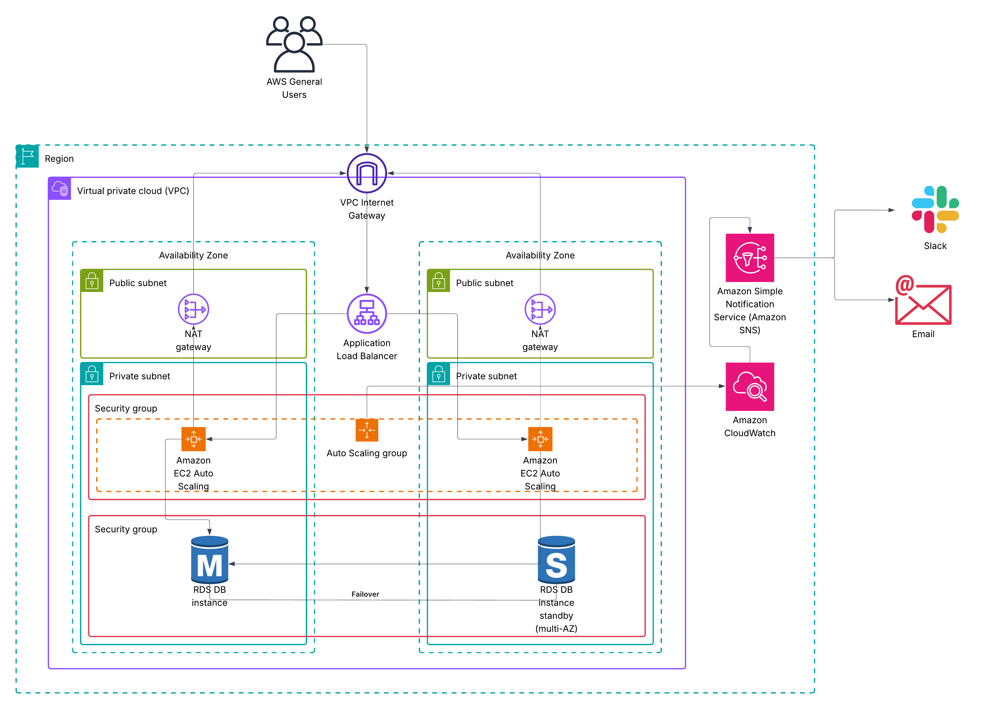

# AWS Scalable Solution Architecture

This repository contains the **solution architecture design and documentation** for a scalable, fault-tolerant AWS infrastructure.  
It demonstrates how to combine **core AWS services** (EC2, RDS, Auto Scaling, ALB, CloudWatch, and SNS) into a reliable cloud-native environment that can handle growth, high availability, and monitoring with alerting.

---

## 📌 Project Deliverables
1. **Solution Architecture Diagram**
   - A visual representation of the proposed AWS solution.
   - Built using **Lucidchart**, but compatible with any diagramming tool.
   - Covers VPC, subnets, EC2 Auto Scaling, RDS Multi-AZ, Application Load Balancer, CloudWatch monitoring, and SNS notifications.

2. **GitHub Repository (this repo)**
   - Contains the **architecture diagram** and **README.md** documentation.
   - Provides a **clear explanation of how each AWS service works together**.

---

## 🏗️ Architecture Overview

The architecture is designed around the following goals:
- **Scalability** → Handle variable workloads using Auto Scaling.
- **High Availability** → Multi-AZ deployment ensures resilience against failures.
- **Monitoring & Alerting** → CloudWatch + SNS ensures proactive detection and notification.
- **Security** → Private subnets for sensitive workloads; public subnets only for load balancers.

### Key AWS Components

- **Amazon VPC (Virtual Private Cloud)**
  - Provides an isolated network for the application.
  - Includes **public subnets** (for ALB, NAT gateways) and **private subnets** (for EC2 and RDS).

- **Application Load Balancer (ALB)**
  - Distributes traffic across EC2 instances in multiple AZs.
  - Ensures fault tolerance and even workload distribution.

- **Amazon EC2 Auto Scaling**
  - Launches or terminates EC2 instances based on traffic.
  - Uses scaling policies (CPU utilization, request count, etc.) for elasticity.

- **Amazon RDS (Multi-AZ)**
  - Relational Database Service with automatic failover.
  - Primary DB instance in one AZ, standby in another AZ.

- **Amazon CloudWatch**
  - Monitors metrics such as CPU utilization, disk space, and ALB errors.
  - Creates alarms when thresholds are breached.

- **Amazon SNS (Simple Notification Service)**
  - Delivers alerts from CloudWatch alarms to subscribers.
  - Subscribers can be **Email**, **Slack Webhook**, or other AWS services.

- **NAT Gateways**
  - Allow private instances (EC2, RDS) to access the internet securely for updates without exposing them directly.

---

## 🔔 Workflow (Step-by-Step)

1. **User Access**
   - End users send requests to the **Application Load Balancer** (public-facing).

2. **Load Balancing**
   - The ALB routes traffic to EC2 instances in the **Auto Scaling Group** across multiple AZs.

3. **Application Layer**
   - EC2 instances process requests and, when needed, connect securely to **Amazon RDS** for database operations.

4. **Database Layer**
   - RDS operates in **Multi-AZ mode**: one primary DB and a standby DB in a different AZ for automatic failover.

5. **Monitoring & Alerts**
   - **CloudWatch** collects performance metrics and system logs.
   - **Alarms** are configured (e.g., EC2 CPU > 80%, ALB 5XX errors, RDS failover).
   - When alarms trigger, they **publish messages to an SNS topic**.

6. **Notifications**
   - SNS pushes notifications to subscribers:
     - **Email** (system administrators)  
     - **Slack** (team channels for instant visibility)  

---

## 📂 Repository Structure

```

.
├── README.md                  # Full project documentation
└── architecture-diagram.png   # Solution architecture diagram (exported from Lucidchart)

````

---

## 📸 Architecture Diagram



*(Replace with your actual Lucidchart export file name if different.)*

---

## 🛠️ Tools & Technologies

- **AWS Services**
  - VPC, Subnets, Security Groups
  - EC2 & Auto Scaling Groups
  - Application Load Balancer (ALB)
  - Amazon RDS (Multi-AZ Deployment)
  - Amazon CloudWatch (Metrics, Logs, Alarms)
  - Amazon SNS (Email & Slack Notifications)
  - NAT Gateway

- **Diagramming Tool**
  - [Lucidchart](https://www.lucidchart.com/) (used to create the architecture diagram)

- **Version Control**
  - GitHub (public repository for submission)

---

## 🚀 How to Use

1. Clone the repository:
   ```bash
   git clone https://github.com/<your-username>/aws-scalable-architecture.git
   cd aws-scalable-architecture
   ```

2. Open the architecture diagram (`architecture-diagram.png`) to review the infrastructure design.

3. Read through this `README.md` for details about the solution.

---

## ✅ Benefits of This Architecture

* **Elasticity** → Automatically adapts to traffic demand with Auto Scaling.
* **Resilience** → Multi-AZ ensures high availability and failover support.
* **Observability** → CloudWatch monitors system health and performance.
* **Proactive Alerting** → SNS delivers notifications to Slack and Email in real time.
* **Security** → Isolated VPC design with public/private subnet separation.

---

## 🔮 Possible Enhancements

* Add **AWS WAF (Web Application Firewall)** to protect against web exploits.
* Use **CloudTrail** for auditing API calls.
* Add **Elasticache (Redis/Memcached)** for performance optimization.
* Enable **CloudWatch Logs Insights** for deeper log analytics.
* Integrate with **EventBridge** for event-driven automation.

---

## ✨ Author

* **Moamen Ahmed**
* GitHub: [@moamen800](https://github.com/moamen800)
* Email: [moamenahmed800@gmailcom](mailto:moamenahmed800@gmailcom

